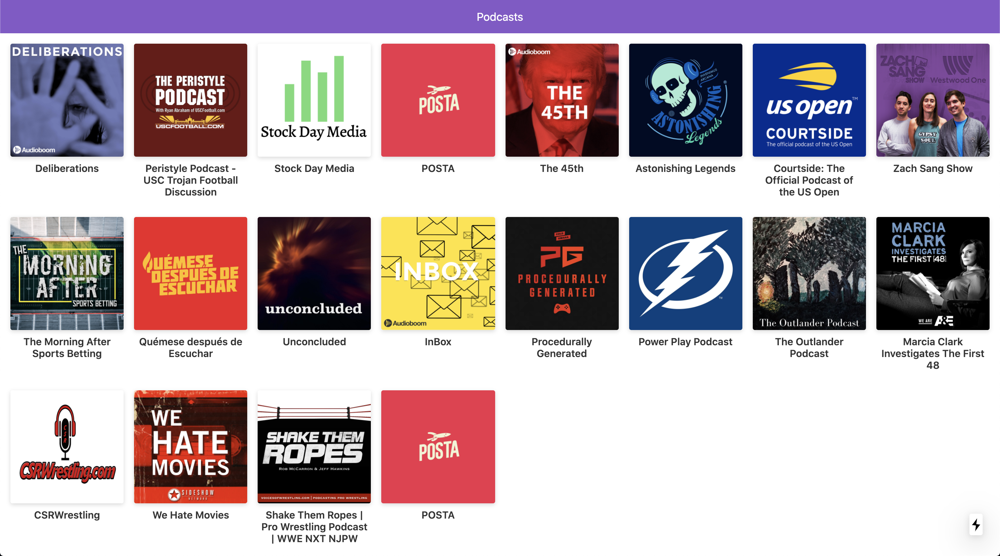

# podcast-page

;

This application consumes the audioboom API to display the podcast and its audios.

The purpose of this application was to explore the possibilities of Next.js in a real implementation.

## How works?

Requiere Node.js >10

- `npm install` to install all dependencies.
- `npm run dev` to run the node server in development environment.
- `npm run build && npm run start` to run the node server in production environment.

## License
ISC
